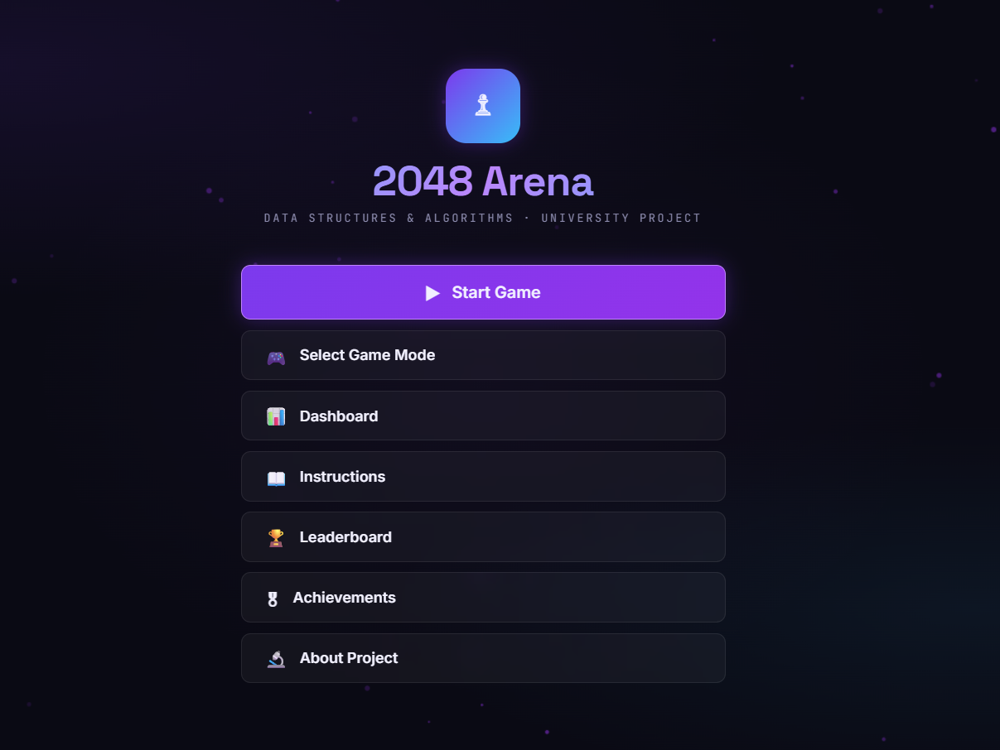
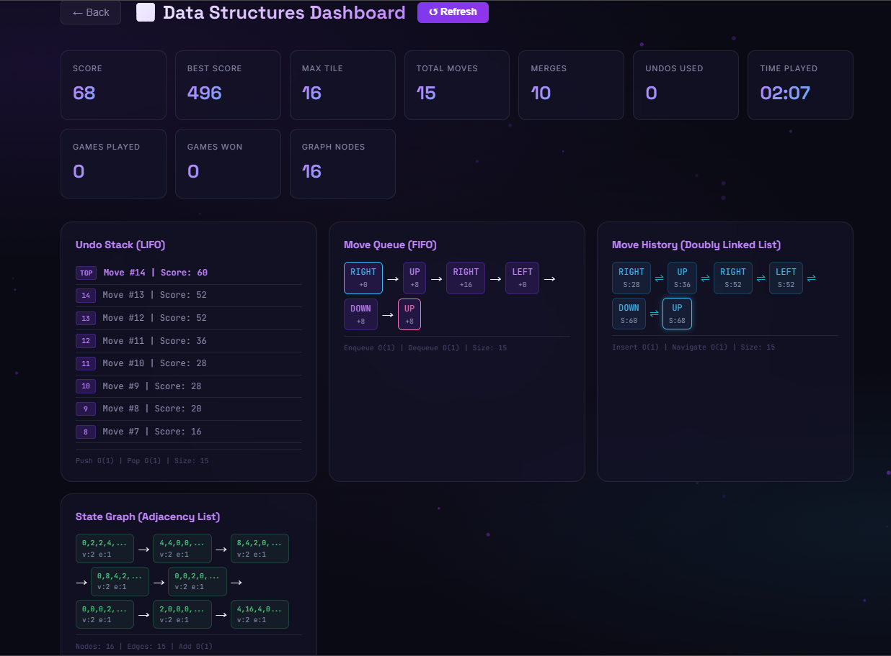
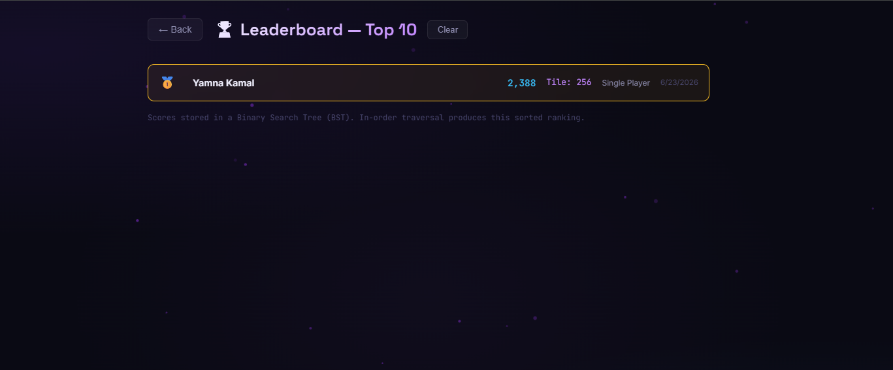
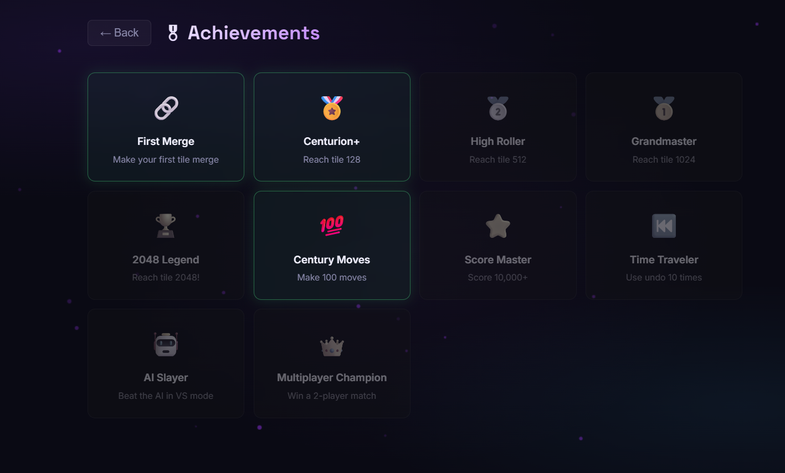

# 2048 Arena 🎮

> A fully playable 2048 game where every core feature is powered by a real Data Structure — built as a DSA semester project at CUST.



---

## 🕹️ Play it

Just open `HTML/index.html` in any browser. No installation, no dependencies, no server needed.

---

## 🎮 Game Modes

| Mode | Description |
|------|-------------|
| **Single Player** | Classic 2048 with undo, save/load, and full DSA visualization |
| **Two Player** | Split-screen. Player 1: WASD · Player 2: Arrow Keys. Race to 2048! |
| **Me vs AI** | You vs a computer opponent. Watch the Game Tree pick moves in real time |

### AI Difficulty
- **Easy** — picks random valid moves
- **Medium** — heuristic: prefers merges, empty cells, corner placement
- **Hard** — Game Tree search (3-ply lookahead)

---

## 🧠 Data Structures Used

Every DSA component is actively used in gameplay — not just demonstrated in isolation.

| Data Structure | Where Used | Purpose |
|----------------|-----------|---------|
| **Stack** (LIFO) | Undo Engine | Stores board snapshots. Pop to restore previous state |
| **Queue** (FIFO) | Move History | Logs every move in chronological order |
| **Doubly Linked List** | History Navigator | Bidirectional forward/backward move navigation |
| **Binary Search Tree** | Leaderboard | Inserts scores in O(log n). In-order traversal = sorted ranking |
| **Graph** (Adjacency List) | State Tracker | Tracks unique board states, detects revisited configurations |
| **N-ary Game Tree** | AI Brain | Evaluates all move sequences up to depth 3, picks highest-scoring path |

### Live DSA Dashboard
Open the **DSA panel** mid-game to see every structure updating in real time as you play — Stack depth, Queue log, Graph nodes and edges, Linked List chain.



---

## 📸 Screenshots

<table>
  <tr>
    <td><br><sub>Game Mode Selection</sub></td>
    <td><br><sub>Single Player</sub></td>
  </tr>
  <tr>
    <td><br><sub>Me vs AI Mode</sub></td>
    <td><br><sub>Two Player Split Screen</sub></td>
  </tr>
  <tr>
    <td><br><sub>BST Leaderboard</sub></td>
    <td><br><sub>Achievements</sub></td>
  </tr>
</table>

---

## 🗂️ Project Structure

```
2048-Arena/
├── HTML/
│   └── index.html        ← entire game (self-contained, open this)
├── CSS/
│   └── style.css         ← standalone styles
├── JS/
│   ├── stack.js          ← Stack (undo engine)
│   ├── queue.js          ← Queue (move history)
│   ├── linkedlist.js     ← Doubly Linked List (history navigator)
│   ├── bst.js            ← Binary Search Tree (leaderboard)
│   ├── graph.js          ← Graph (state tracker)
│   ├── tree.js           ← Game Tree (AI evaluation)
│   ├── ai.js             ← AI Player (difficulty strategies)
│   ├── game.js           ← Core Game Engine
│   └── app.js            ← App Controller (UI & routing)
└── README.md
```

> **Note:** `index.html` is fully self-contained — all JS and CSS are embedded inside it. The separate JS/CSS files are the modular reference versions.

---

## ⚙️ Features

- ✅ Undo / Redo moves (Stack, up to 50 states)
- ✅ Save & Load game state (localStorage)
- ✅ BST-backed leaderboard with persistent scores
- ✅ Graph-based state tracking with cycle detection
- ✅ Live DSA visualization dashboard
- ✅ Achievement system (First Merge, Centurion+, AI Slayer, and more)
- ✅ Animated particle background
- ✅ Fully responsive — keyboard and swipe support

---

## 🛠️ Built With

- Vanilla JavaScript (ES6+)
- HTML5 & CSS3
- Zero external libraries or frameworks

---

## 👩‍💻 Author

**Yamna Kamal**  
BS Artificial Intelligence — Capital University of Science and Technology (CUST)  
[LinkedIn]: https://www.linkedin.com/in/yamna-kamal-119b9234b/ <!-- replace with your actual LinkedIn URL -->

---

## 📄 License

This project was built for academic purposes as part of a DSA course at CUST.
